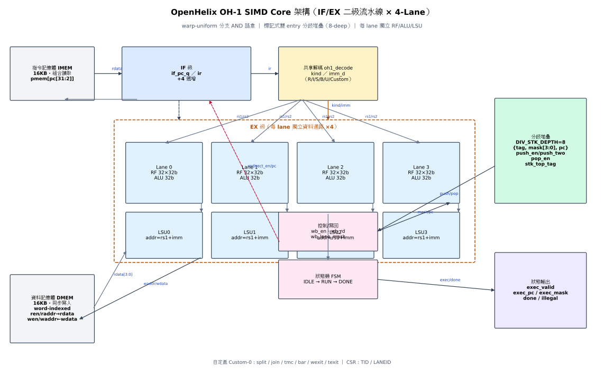

# OpenHelix OH-1

**4-lane SIMT micro-core with warp divergence stack** — a GPU-semantic SIMD core small enough to verify completely, open enough to modify.

[](https://github.com/tonythetiger168/openhelix-oh1/actions/workflows/ci.yml)
[](LICENSE)

## What is OH-1?

OH-1 brings **GPU warp semantics** (split / join / tmc) into a 2-stage-pipeline, MCU-class micro-core:

- **21-instruction ISA** — RV32I-like integer core + Custom-0 SIMT control (split / join / tmc / bar / wexit / texit)
- **Warp-uniform branching** — a branch is taken only if *all* active lanes agree (AND semantics)
- **Marked dual-entry divergence stack** — 8-deep, split pushes tag + else entries; join pops else first, then tag restores the mask
- **Per-lane datapath** — 4 × (32×32b RF + ALU + LSU), lockstep single-issue
- **Low power by construction** — per-lane operand isolation: dynamic power scales with active-lane count
- **AXI4-Lite peripheral wrapper** — drop into any SoC as an accelerator (register map + memory windows + IRQ)

## Quick start

```bash
source tools/env.sh        # pinned toolchain (verilator 5.052 / yosys 0.65 / iverilog 13 / pyslang)

make smoke                 # directed smoke — 12 checks, divergent sw/lw, split/join, branches
make simd                  # SIMD engine — 14 per-lane checks (ALU/LSU/TMC/divergence)
make rand  SEED=7 N_PROG=50  # CRV: random ISA programs vs instruction-level golden ISS
make lint                  # verilator -Wall  → 0 errors 0 warnings
make lint-yosys            # yosys 0.65 elaboration check
```

## Verification matrix

| Layer | Mechanism | Status |
|---|---|---|
| Directed | `tb_smoke` 12 checks, `tb_simd` 14 per-lane checks | ✅ PASS |
| CRV | `tb_rand` — constrained-random programs vs independent ISS, per-cycle PC/mask/WB compare, RF+dmem final-state compare | ✅ 80/80 programs |
| UVM | 7-file env: CRV program generator (split/join statically balanced), instruction-level ISS scoreboard, 8 covergroups | ✅ delivered (sign-off on VCS/Xcelium) |
| SVA | 15 assertions + 17 cover properties (stack bounds, mask contiguity, done quiescence, alignment) | ✅ bound |
| Lint | verilator 5.052 `-Wall` + yosys 0.65 + pyslang 12 (slang) cross-check | ✅ 0/0 |

Every RTL change is regression-gated by smoke + simd + rand.

## Architecture



- 2-stage pipeline (IF/EX) — redirect penalty is exactly 1 bubble, the SIMT sweet spot
- Divergence handled by a **marked dual-entry stack**, not reconvergence counters
- TMC re-masks dynamically (lane-0 value, clamped, guaranteed contiguous low-ones by SVA)
- Operand isolation makes power ∝ active lanes — divergence *saves* energy

## Repository layout

```
rtl/        oh1_pkg.sv (ISA), oh1_decode.sv, oh1_core.sv, oh1_axi_lite.sv (M2.0 W2)
tb/         smoke / simd / rand / axi testbenches + 7-file UVM environment
doc/        architecture.svg, lint/coverage/low-power reports, Tensor-Lite & multi-warp specs
tools/      pinned toolchain: env.sh + manifest.txt (SHA-256 for every artifact, offline-reproducible)
```

## Roadmap

| Milestone | Content | Status |
|---|---|---|
| M0.2 | Core closure: RTL freeze, lint clean, CRV verified, low-power isolation | ✅ |
| M0.3 | Toolchain pinned from source (verilator 5.052 / yosys 0.65 / iverilog 13 / pyslang) | ✅ |
| M1.0 | Specs frozen: Tensor-Lite FP16 vdot, AXI4-Lite, multi-warp wspawn, LLVM backend plan | ✅ |
| M2.0 | RTL implementation of M1.0 (AXI verified 4/4; vdot MAC & 2-warp scheduler next) | 🔧 |
| M2.0+ | FPGA reference (Edge), safety derivative (lockstep + ECC), education ecosystem | 🗺️ |

Positioning: NVIDIA's stack stops at Jetson (7–15 W). OH-1 targets the open, deterministic, sub-watt SIMT niche below it — open RTL, full verification assets, reproducible toolchain.

## License

MIT (see [LICENSE](LICENSE)).
